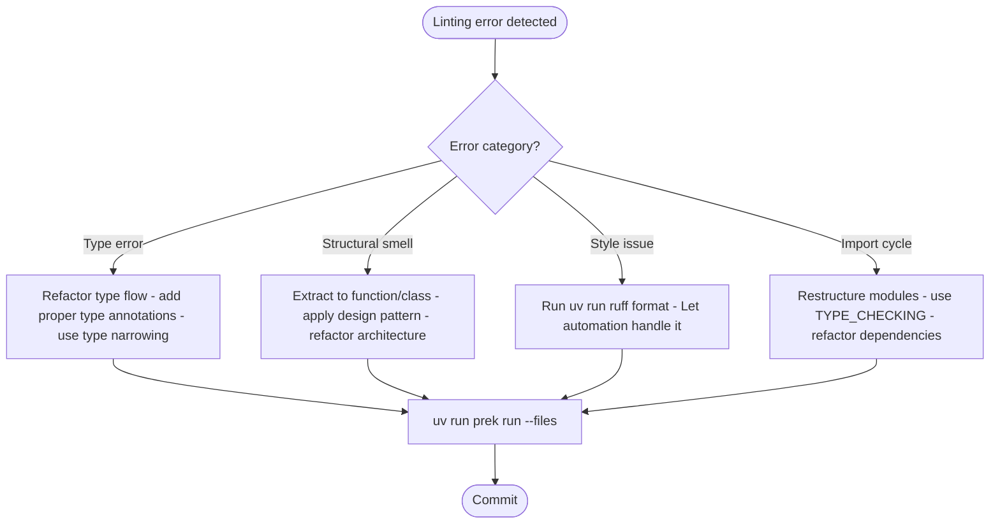

# AI Agent Instructions - MCP JSON/YAML/TOML Server

<identity>
This document guides all AI agents (Claude Code, GitHub Copilot, Cursor) working in this repository. Follow these instructions to ensure consistency, quality, and architectural integrity.
</identity>

---

## Project Context

<context>
**Purpose**: MCP server for advanced JSON/YAML/TOML manipulation using `yq`

**Stack**: Python 3.11-3.12+, FastMCP, uv, hatchling

**Core Modules**:

- `yq_wrapper.py` - Local binary management
- `schemas.py` - Schema discovery
- `lmql_constraints.py` - Constraint validation

**Design Principles**:

- 100% local processing (zero API keys required)
- High-fidelity format preservation (comments, anchors)
- Cursor-based pagination (10KB chunks for large files)
  </context>

---

## Critical Constraints

<constraints>

### Dependency Management

Use `uv add/remove` exclusively for dependency changes. These commands handle version resolution, lockfile updates, and installation atomically.

```bash
uv add <package>          # Runtime dependency
uv add --dev <package>    # Development dependency
uv remove <package>       # Remove dependency
```

**Reason**: Manual `pyproject.toml` edits bypass dependency resolution and create lock inconsistencies.

### Linting Rule Configuration

Preserve existing lint rule configurations in `pyproject.toml`. Rules have been calibrated for this codebase's architecture.

**Reason**: Rule modifications affect CI gates and may mask structural issues.

### Type Checking

Run both mypy and basedpyright on all changes. Both type checkers are required gates.

**Reason**: Each catches different type safety issues - mypy for runtime behavior, basedpyright for strict correctness.

### Environment Execution

Execute all commands through `uv run` (not bare `python` or `pip install`).

**Reason**: `uv run` ensures virtual environment isolation and dependency availability.

</constraints>

---

## Holistic Linting Philosophy

<linting_philosophy>

Linting errors signal deeper issues (architecture, type flow, logic). Apply these principles:

### Resolution Over Suppression

Address root causes rather than suppressing symptoms. Avoid `# type: ignore` or `# noqa` for structural/type problems.

**Decision Flow**:



### Automation Over Manual Work

Delegate formatting to automated tools:

- `uv run ruff format` - Python formatting
- `npx prettier --write` - YAML/JSON/Markdown formatting

### Scoped Verification

Verify only changed files during feature work:

```bash
uv run prek run --files <file_path1> <file_path2>
```

**Never** use `--all-files` during feature work to avoid diff pollution and history destruction.

</linting_philosophy>

---

## Quality Gates

<quality_gates>

All code passes these gates before merge:

| Gate         | Command                                    | Purpose                        |
| ------------ | ------------------------------------------ | ------------------------------ |
| **Format**   | `uv run ruff format --check`               | Python formatting verification |
| **Lint**     | `uv run ruff check`                        | 500+ Python linting rules      |
| **Type 1**   | `uv run mypy packages/ --show-error-codes` | Mypy static analysis           |
| **Type 2**   | `uv run basedpyright packages/`            | Pyright strict analysis        |
| **Markdown** | `npx markdownlint-cli2 "**/*.md"`          | Markdown style enforcement     |
| **Prettier** | `npx prettier --check`                     | YAML/JSON/MD formatting        |
| **Tests**    | `uv run pytest`                            | Test suite with coverage       |

### One-Shot Verification

After editing any file:

```bash
uv run prek run --files <file_path1> <file_path2>
```

This runs all applicable gates on changed files only.

</quality_gates>

---

## Development Workflow

<workflow>

### Initial Setup

```bash
uv sync  # Install dependencies and dev tools
```

### Testing

**Location**: `packages/mcp_json_yaml_toml/tests/`
**Naming**: `test_*.py`
**Fixtures**: `conftest.py` for shared fixtures
**Coverage**: Minimum 60% for new features (current: ~79%)
**Execution**: Tests run in parallel automatically

```bash
uv run pytest              # Run all tests
uv run pytest -k <pattern> # Run specific tests
uv run packages/mcp_json_yaml_toml/tests/verify_features.py  # Manual feature verification
```

### Commit Format

```text
<type>(<scope>): <description>
```

**Types**: feat, fix, chore, docs, test, refactor, perf, ci, style, build
**Scope**: Mandatory (examples: `feat(server)`, `fix(yq)`)

</workflow>

---

## Architecture Principles

<architecture>

### DRY & SRP

Extract common patterns into base classes. See `RegexConstraint` for pattern.

**Reason**: Prevents duplication and enforces single responsibility.

### Unified Tools

Use unified `data` and `data_schema` tools with parameters instead of creating tool proliferation.

**Reason**: Reduces cognitive load for LLM tool selection and maintains consistent interface.

### Format Preservation

Use `ruamel.yaml` and `tomlkit` to maintain file fidelity.

**Reason**: Preserves comments, anchors, and formatting that users rely on.

### Pagination Strategy

Implement cursor-based pagination with 10KB chunks for large files.

**Reason**: Prevents context window overflow while maintaining usability.

</architecture>
