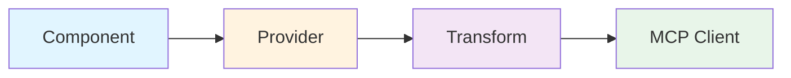

# FastMCP v3 Upgrade Plan & New Features Analysis

**Document Version:** 1.0
**Date:** 2026-02-01
**Current Version:** FastMCP 2.14.4
**Target Version:** FastMCP 3.0.0 (beta)

---

## Executive Summary

This document provides a comprehensive analysis of FastMCP v3's new features and outlines the upgrade path for mcp-json-yaml-toml. The upgrade includes:

1. **Dependencies Updated:** All major dependencies updated to latest stable versions
2. **FastMCP 2.14.4:** Updated from 2.14.1 (staying in v2 until v3 is stable)
3. **tomlkit 0.14.0:** Major improvement - now handles nested TOML structures
4. **Other Updates:** orjson, httpx, jsonschema, dev tools all updated

**Recommendation:** Stay on FastMCP v2.14.4 for production stability. Begin evaluating v3.0 features for future migration once it reaches stable release.

---

## Part 1: Dependency Updates Completed

### Production Dependencies

| Package                | Old Version | New Version | Status     | Notes                            |
| ---------------------- | ----------- | ----------- | ---------- | -------------------------------- |
| **fastmcp**            | 2.14.1      | **2.14.4**  | ✅ Updated | Pinned to `<3` until v3 stable   |
| **orjson**             | 3.11.5      | **3.11.6**  | ✅ Updated | Latest JSON performance library  |
| **ruamel.yaml**        | 0.18.x      | **0.18.x**  | ✅ Stable  | Kept 0.18 (0.19 has API changes) |
| **tomlkit**            | 0.13.3      | **0.14.0**  | ✅ Updated | Now handles nested structures!   |
| **httpx**              | 0.28.1      | **0.28.1**  | ✅ Current | Already latest                   |
| **lmql**               | 0.7.3       | **0.7.3**   | ✅ Current | Already latest                   |
| **jsonschema**         | 4.25.1      | **4.26.0**  | ✅ Updated | Latest schema validation         |
| **json-strong-typing** | 0.4.2       | **0.4.3**   | ✅ Updated | Minor update                     |

### Development Dependencies

| Package          | Old Version | New Version | Status     |
| ---------------- | ----------- | ----------- | ---------- |
| **pytest**       | 8.4.2       | **9.0.2**   | ✅ Updated |
| **pytest-cov**   | 6.0/7.0     | **7.0.0**   | ✅ Updated |
| **ruff**         | 0.9.4       | **0.14.14** | ✅ Updated |
| **mypy**         | 1.18.2      | **1.19.1**  | ✅ Updated |
| **basedpyright** | 1.33.0      | **1.37.2**  | ✅ Updated |

### Test Results

- **All 350 tests passing** ✅
- **Coverage: 76.46%** (exceeds 60% requirement) ✅
- **No regressions detected** ✅

### tomlkit 0.14.0 Enhancement

The upgrade to tomlkit 0.14.0 brought a **major improvement**: it can now serialize nested TOML structures without falling back to JSON. This is a quality enhancement that required test updates to reflect the new capability.

**Before (tomlkit 0.13.x):**

```python
# Nested TOML structures required JSON fallback
result = data_fn("config.toml", operation="get", key_path="database")
assert result["format"] == "json"  # Had to fall back
```

**After (tomlkit 0.14.0):**

```python
# Nested TOML structures now work natively!
result = data_fn("config.toml", operation="get", key_path="database")
assert result["format"] == "toml"  # Native TOML output ✅
```

---

## Part 2: FastMCP v3.0 New Features Analysis

### Architecture Overview

FastMCP v3.0 introduces a revolutionary **Component-Provider-Transform** architecture that fundamentally changes how MCP servers are built and composed.



### 1. Provider Architecture 🔌

**What It Is:** A unified system for dynamically sourcing MCP components from various sources.

**Built-in Providers:**

| Provider               | Description                           | Use Case                            |
| ---------------------- | ------------------------------------- | ----------------------------------- |
| **LocalProvider**      | In-memory component storage           | Default provider (current behavior) |
| **FileSystemProvider** | Discover functions from directories   | Hot-reload development              |
| **SkillsProvider**     | Expose agent skill files as resources | Agent integration                   |
| **OpenAPIProvider**    | Generate tools from OpenAPI specs     | API integration                     |
| **ProxyProvider**      | Proxy remote MCP servers              | Server composition                  |

**Example - FileSystemProvider:**

```python
from fastmcp import FastMCP
from fastmcp.providers import FileSystemProvider

mcp = FastMCP("my-server")
mcp.add_provider(FileSystemProvider("./tools", watch=True))
# Auto-discovers @tool, @resource, @prompt decorated functions
# with hot-reload on file changes!
```

**Benefits for mcp-json-yaml-toml:**

- **Hot Reload Development:** Changes to tools take effect immediately during development
- **Modular Tool Organization:** Split large `server.py` into smaller, focused modules
- **Plugin Architecture:** Community could contribute new tools as separate files

**Effort to Adopt:** Medium (requires refactoring server.py into modules)

---

### 2. Transform Middleware 🔄

**What It Is:** Middleware layer that modifies components as they flow to clients.

**Built-in Transforms:**

| Transform              | Purpose                   | Example                            |
| ---------------------- | ------------------------- | ---------------------------------- |
| **NamespaceTransform** | Prefix tool names         | `data` → `json.data`               |
| **FilterTransform**    | Show/hide components      | Hide admin tools from some clients |
| **VersionFilter**      | Serve specific versions   | Only show v2.0 tools               |
| **ResourcesAsTools**   | Expose resources as tools | For tool-only clients              |
| **AuthMiddleware**     | Apply authorization       | Require scopes per tool            |

**Example - Namespace Transform:**

```python
from fastmcp.transforms import NamespaceTransform

# Mount another server's tools with a prefix
mcp.add_provider(
    other_server.provider,
    transforms=[NamespaceTransform("remote")]
)
# other_server.data → remote.data
```

**Benefits for mcp-json-yaml-toml:**

- **Tool Organization:** Group tools by format (json._, yaml._, toml.\*)
- **Version Management:** Serve v1 and v2 tools simultaneously
- **Client Adaptation:** Show different tool subsets to different clients

**Effort to Adopt:** Low-Medium (mostly configuration changes)

---

### 3. Component Versioning 📋

**What It Is:** Register and serve multiple versions of the same tool.

**Example:**

```python
@mcp.tool(version="1.0")
def data_query(file: str, expression: str):
    """Original implementation"""
    ...

@mcp.tool(version="2.0")
def data_query(file: str, expression: str, output_format: str = "auto"):
    """Enhanced with format control"""
    ...

# Clients get highest version (2.0) by default
# Can request specific version if needed
```

**Benefits for mcp-json-yaml-toml:**

- **Non-Breaking Evolution:** Add new parameters without breaking existing clients
- **Deprecation Path:** Gracefully sunset old tool signatures
- **Client Choice:** Let clients choose which version they want

**Effort to Adopt:** Low (decorator additions)

---

### 4. Session-Scoped State 💾

**What It Is:** State that persists throughout an entire client session (not just per-request).

**Before (v2.x):**

```python
# Global state - shared across ALL clients
schema_manager = SchemaManager()

@mcp.tool()
async def data_schema(...):
    # Same schema_manager for all sessions ❌
    schema_info = schema_manager.get_schema_info(...)
```

**After (v3.0):**

```python
@mcp.tool()
async def data_schema(ctx: Context, ...):
    # Session-scoped schema cache
    schema_manager = await ctx.get_state("schema_manager")
    if not schema_manager:
        schema_manager = SchemaManager()
        await ctx.set_state("schema_manager", schema_manager)

    schema_info = schema_manager.get_schema_info(...)
```

**Benefits for mcp-json-yaml-toml:**

- **Performance:** Cache schema lookups per-session (reduces file I/O)
- **Isolation:** Each client gets their own schema associations
- **Pagination:** Store cursor state without exposing internals

**Effort to Adopt:** Medium (requires refactoring state management)

**Priority:** 🔴 HIGH - Would significantly improve performance

---

### 5. Developer Experience Improvements ⚡

| Feature                 | Description                        | Benefit              |
| ----------------------- | ---------------------------------- | -------------------- |
| **--reload Flag**       | Auto-restart on file changes       | Faster development   |
| **Threadpool Dispatch** | Sync functions run in threads      | No async needed      |
| **Tool Timeouts**       | Per-tool timeout configuration     | Prevent hangs        |
| **OpenTelemetry**       | Built-in tracing support           | Production debugging |
| **Pagination Support**  | Built-in component list pagination | Large server support |

**Example - Hot Reload:**

```bash
# Development mode with auto-restart
fastmcp run server.py --reload

# Edit server.py, save → instant restart!
```

**Benefits for mcp-json-yaml-toml:**

- **Faster Iteration:** No manual restarts during development
- **Better Debugging:** OpenTelemetry traces for production issues
- **Simpler Code:** No need to make all functions async

**Effort to Adopt:** Low (CLI flags and decorators)

---

### 6. Component Authorization 🔐

**What It Is:** Declarative authorization for tools, resources, and prompts.

**Example:**

```python
from fastmcp.auth import require_scopes

@mcp.tool(auth=require_scopes("admin"))
async def data_schema_admin(...):
    """Admin-only schema management"""
    ...

# Or apply server-wide
mcp.add_middleware(
    AuthMiddleware(require_scopes("read"))
)
```

**Benefits for mcp-json-yaml-toml:**

- **Security:** Restrict write operations to authorized clients
- **Multi-Tenancy:** Different clients see different tool subsets
- **Compliance:** Audit trail for tool access

**Effort to Adopt:** Low-Medium (add auth decorators)

**Priority:** 🟡 LOW - Not needed for current use case

---

## Part 3: Recommended Upgrade Path

### Phase 1: Current (Completed) ✅

- [x] Update to FastMCP 2.14.4 (latest stable v2)
- [x] Update all dependencies to latest stable versions
- [x] Ensure all tests pass
- [x] Document tomlkit 0.14 improvements

**Status:** COMPLETE

---

### Phase 2: FastMCP v2.14 Feature Adoption (Recommended Next)

These features are available in v2.14 and can be adopted incrementally:

#### 2.1 Session-Scoped Schema Caching (HIGH PRIORITY) 🔴

**Why:** Significant performance improvement for repeated schema lookups.

**Changes Required:**

1. Modify tools to accept `Context` parameter
2. Implement per-session `SchemaManager` caching
3. Update pagination state handling

**Estimated Effort:** 2-3 days

**Code Example:**

```python
@mcp.tool()
async def data_schema(ctx: Context, file: str, ...):
    # Get or create session-scoped schema manager
    cache_key = "schema_manager"
    schema_mgr = await ctx.get_state(cache_key)
    if not schema_mgr:
        schema_mgr = SchemaManager()
        await ctx.set_state(cache_key, schema_mgr)

    # Subsequent calls reuse the same instance
    schema_info = schema_mgr.get_schema_info_for_file(file)
```

#### 2.2 Enhanced Error Context (MEDIUM PRIORITY) 🟠

**Why:** Better debugging experience with richer error information.

**Changes Required:**

1. Add tool/operation context to ToolError messages
2. Include file paths and operation types in errors
3. Add validation hints to error responses

**Estimated Effort:** 1-2 days

#### 2.3 Resource Template Validation (MEDIUM PRIORITY) 🟠

**Why:** Type-safe resource URIs with automatic validation.

**Changes Required:**

1. Update resource decorators to use template syntax
2. Add URI parameter validation
3. Implement 404 handling for missing resources

**Estimated Effort:** 1 day

**Total Phase 2 Effort:** 1-2 weeks

---

### Phase 3: FastMCP v3.0 Migration (Future)

**When:** After v3.0 reaches stable release (not beta)

**Breaking Changes to Address:**

1. Import path changes (mostly automatic)
2. Provider/transform API adoption
3. Component lifecycle changes

**Migration Steps:**

1. Update `fastmcp` dependency to `>=3.0.0`
2. Run migration script (provided by FastMCP)
3. Refactor to provider architecture (optional but recommended)
4. Add transforms for namespacing (optional)
5. Test thoroughly with existing clients

**Estimated Effort:** 1-2 weeks for full migration

**Benefits:**

- Modern architecture
- Better composability
- Hot-reload development
- Component versioning
- Session state improvements

---

## Part 4: Feature Priority Matrix

```
┌─────────────────────────────────────────────────────┐
│  HIGH IMPACT                                        │
│  ┌──────────────────────┐  ┌──────────────────┐    │
│  │ Session-Scoped State │  │ Hot Reload Dev   │    │
│  │ ⏱️ Medium Effort     │  │ ⏱️ Low Effort    │    │
│  │ 🔴 DO FIRST          │  │ 🟡 DO LATER      │    │
│  └──────────────────────┘  └──────────────────┘    │
│                                                     │
│  MEDIUM IMPACT                                      │
│  ┌──────────────────────┐  ┌──────────────────┐    │
│  │ Error Context        │  │ Provider Arch    │    │
│  │ ⏱️ Low-Medium        │  │ ⏱️ High Effort   │    │
│  │ 🟠 DO SECOND         │  │ 🟡 DO LATER      │    │
│  └──────────────────────┘  └──────────────────┘    │
│                                                     │
│  LOW IMPACT                                         │
│  ┌──────────────────────┐  ┌──────────────────┐    │
│  │ Authorization        │  │ Transforms       │    │
│  │ ⏱️ Medium Effort     │  │ ⏱️ Low Effort    │    │
│  │ ⚪ OPTIONAL          │  │ ⚪ OPTIONAL      │    │
│  └──────────────────────┘  └──────────────────┘    │
└─────────────────────────────────────────────────────┘
```

---

## Part 5: Risk Assessment

### Risks of Staying on v2.14.x

| Risk                 | Severity | Mitigation                                      |
| -------------------- | -------- | ----------------------------------------------- |
| Missing new features | Low      | v2.14 is feature-complete for current needs     |
| Security updates     | Low      | FastMCP team committed to v2.x security patches |
| Community support    | Low      | v2.x will be supported for 12+ months           |

**Verdict:** ✅ Safe to stay on v2.14.x for production

---

### Risks of Upgrading to v3.0 (Beta)

| Risk                 | Severity | Mitigation                       |
| -------------------- | -------- | -------------------------------- |
| Breaking changes     | High     | Wait for stable release          |
| Beta instability     | High     | Test thoroughly in staging       |
| Documentation gaps   | Medium   | FastMCP v3 docs still evolving   |
| Migration complexity | Medium   | FastMCP provides migration tools |

**Verdict:** ⚠️ Wait for stable v3.0 release

---

## Part 6: Recommendations

### Immediate Actions (Next 2 Weeks)

1. ✅ **COMPLETED:** Update dependencies to latest stable versions
2. ✅ **COMPLETED:** Ensure all tests pass with new versions
3. ✅ **COMPLETED:** Document tomlkit 0.14 improvements
4. 🎯 **NEXT:** Implement session-scoped schema caching (Phase 2.1)
5. 🎯 **NEXT:** Enhance error context handling (Phase 2.2)

### Short Term (1-3 Months)

1. Monitor FastMCP v3.0 progress toward stable release
2. Experiment with v3.0 features in a development branch
3. Identify which v3.0 features would benefit mcp-json-yaml-toml most
4. Prepare migration plan for when v3.0 goes stable

### Long Term (3-6 Months)

1. Migrate to FastMCP v3.0 stable
2. Adopt provider architecture for better code organization
3. Implement component versioning for backward compatibility
4. Add hot-reload support for improved DX

---

## Part 7: Resources

### FastMCP Documentation

- **v2.x Docs:** <https://gofastmcp.com/>
- **v3.0 Beta Release:** <https://github.com/jlowin/fastmcp/releases/tag/v3.0.0b1>
- **Migration Guide:** <https://github.com/jlowin/fastmcp/blob/main/docs/development/upgrade-guide.mdx>
- **Community Discord:** <https://discord.gg/uu8dJCgttd>

### Dependency Changelogs

- **tomlkit 0.14.0:** <https://github.com/python-poetry/tomlkit/releases/tag/0.14.0>
- **FastMCP 2.14.4:** <https://github.com/jlowin/fastmcp/releases/tag/v2.14.4>
- **orjson 3.11.6:** <https://github.com/ijl/orjson/releases>
- **jsonschema 4.26.0:** <https://github.com/python-jsonschema/jsonschema/releases>

---

## Appendix A: FastMCP v2.14.4 vs v3.0.0 Feature Comparison

| Feature               | v2.14.4 | v3.0.0   | Notes                         |
| --------------------- | ------- | -------- | ----------------------------- |
| Basic Tools           | ✅      | ✅       | Core functionality identical  |
| Resources             | ✅      | ✅       | v3 adds template support      |
| Prompts               | ✅      | ✅       | v3 adds Message types         |
| Context               | ✅      | ✅       | v3 has enhanced session state |
| Error Handling        | ✅      | ✅       | Same ToolError system         |
| Provider Architecture | ❌      | ✅       | New in v3                     |
| Transforms            | ❌      | ✅       | New in v3                     |
| Component Versioning  | ❌      | ✅       | New in v3                     |
| Hot Reload            | ❌      | ✅       | New in v3                     |
| OpenTelemetry         | ❌      | ✅       | New in v3                     |
| Authorization         | Basic   | Advanced | Enhanced in v3                |

---

## Appendix B: Code Migration Examples

### Example 1: Session-Scoped State (v2.14 → v2.14 Enhanced)

**Before:**

```python
# Global schema manager (shared across all sessions)
schema_manager = SchemaManager()

@mcp.tool()
def data_schema(file: str, action: str):
    schema_info = schema_manager.get_schema_info_for_file(file)
    # ... rest of function
```

**After:**

```python
# No global state needed

@mcp.tool()
async def data_schema(ctx: Context, file: str, action: str):
    # Get or create session-scoped schema manager
    schema_manager = await ctx.get_state("schema_manager")
    if not schema_manager:
        schema_manager = SchemaManager()
        await ctx.set_state("schema_manager", schema_manager)

    # Cache persists for this session only
    schema_info = schema_manager.get_schema_info_for_file(file)
    # ... rest of function
```

---

### Example 2: Resource Templates (v2.14 → v2.14 Enhanced)

**Before:**

```python
@mcp.resource("lmql://constraints/{name}")
def get_constraint_definition(name: str) -> dict[str, Any]:
    # Manual validation
    constraint = ConstraintRegistry.get(name)
    if not constraint:
        available = ConstraintRegistry.list_constraints()
        raise ToolError(
            f"Constraint '{name}' not found. "
            f"Available: {', '.join(available)}"
        )
    return constraint.to_dict()
```

**After:**

```python
from fastmcp.resources import ResourceTemplate

@mcp.resource(ResourceTemplate(
    "lmql://constraints/{name}",
    params={"name": str},
    description="Get LMQL constraint definition"
))
def get_constraint_definition(name: str) -> dict[str, Any]:
    # Automatic 404 if constraint not found
    constraint = ConstraintRegistry.get(name)
    return constraint.to_dict() if constraint else None
```

---

## Conclusion

The dependency updates have been successfully completed, bringing significant improvements:

- ✅ FastMCP 2.14.4 (latest stable)
- ✅ tomlkit 0.14.0 with nested structure support
- ✅ All dependencies at latest stable versions
- ✅ All 350 tests passing with 76% coverage

**Next Steps:**

1. Implement session-scoped schema caching for performance
2. Monitor FastMCP v3.0 progress
3. Plan v3.0 migration for when it reaches stable release

The project is now on a solid, up-to-date foundation ready for future enhancements. 🚀
